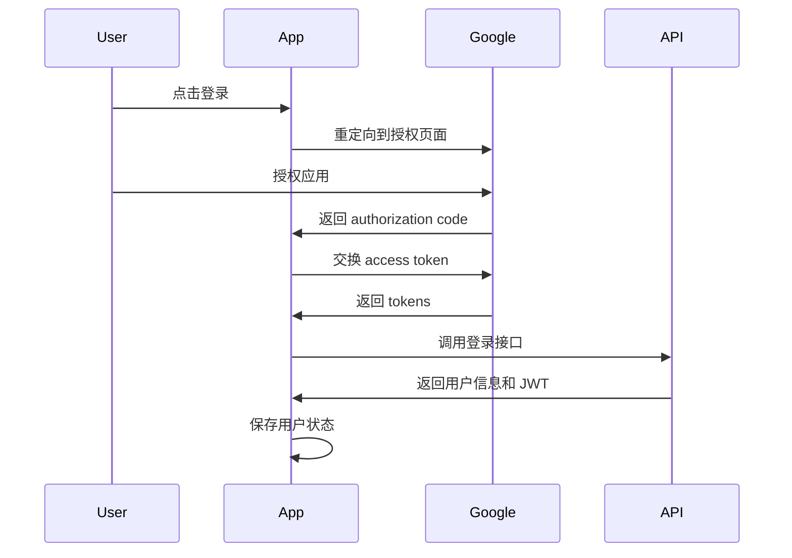

# Nikosolo Web2 项目架构指南

## 项目概述

Nikosolo Web2 是一个基于 React + TypeScript + Vite 的现代化 AI 内容生成平台，采用完全响应式设计和模块化架构。项目已完成从 CSS Modules 到 Tailwind CSS 的完整迁移，并建立了标准化的 API 服务层。

### 核心特性
- 🎨 AI 驱动的内容生成（图像、视频、音频、文本）
- 🔐 完整的 Google OAuth 认证系统
- 📱 完全响应式设计（移动端优先）
- 🔄 实时内容流和瀑布流布局
- 🛠 工作流和模型管理
- 💫 现代化 UI/UX 设计

## 技术栈

### 前端核心
- **框架**: React 18 + TypeScript 5
- **构建工具**: Vite 5
- **样式系统**: Tailwind CSS 3.4（完全迁移）
- **状态管理**: Jotai（原子化状态管理）
- **路由**: React Router DOM v7
- **开发语言**: TypeScript (严格模式)

### UI 和交互
- **设计系统**: 自定义 Tailwind 配置
- **字体**: Lexend（主要字体）
- **图标**: 自定义 SVG 图标系统
- **响应式**: 移动端优先的响应式设计

### 开发工具
- **代码规范**: ESLint + TypeScript
- **样式处理**: PostCSS + Autoprefixer
- **类型检查**: TypeScript strict mode
- **开发服务器**: Vite dev server with HMR

## 项目目录结构

```
nikosolo/
├── docs/                           # 项目文档
│   ├── API_DOCUMENTATION_ZH.md     # API 文档
│   ├── WEB2_ARCHITECTURE_GUIDE.md  # 架构指南（本文档）
│   └── ...
├── public/                         # 静态资源
│   ├── activity_banner.png
│   └── ...
├── src/
│   ├── components/                 # 组件目录
│   │   ├── layout/                 # 布局组件
│   │   │   ├── AppLayout.tsx       # 应用主布局
│   │   │   ├── Header.tsx          # 顶部导航栏
│   │   │   ├── Sidebar.tsx         # 侧边栏
│   │   │   └── MainContent.tsx     # 主内容区域
│   │   ├── ui/                     # 基础 UI 组件
│   │   │   ├── ThemeToggle.tsx     # 主题切换
│   │   │   ├── LanguageSelector.tsx # 语言选择器
│   │   │   └── ...
│   │   ├── home/                   # 首页组件
│   │   │   ├── Banner.tsx          # 首页横幅
│   │   │   ├── PopularWorkflows.tsx # 热门工作流
│   │   │   ├── TrendingStyles.tsx  # 流行风格
│   │   │   ├── InspirationFeed.tsx # 灵感内容流
│   │   │   ├── WorkflowCard.tsx    # 工作流卡片
│   │   │   └── ...
│   │   ├── recipes/                # Recipes 页面组件
│   │   │   ├── WorkflowsList.tsx   # 工作流列表
│   │   │   ├── StylesList.tsx      # 风格列表
│   │   │   └── ...
│   │   ├── modals/                 # 模态框组件
│   │   │   ├── LoginModal.tsx      # 登录模态框
│   │   │   └── ...
│   │   └── shared/                 # 共享组件
│   ├── pages/                      # 页面组件
│   │   ├── Home.tsx                # 首页
│   │   ├── Recipes.tsx             # Recipes 页面
│   │   ├── Profile.tsx             # 用户资料页
│   │   ├── AuthCallback.tsx        # OAuth 回调页
│   │   └── ...
│   ├── store/                      # 状态管理（Jotai）
│   │   ├── loginStore.ts           # 用户认证状态
│   │   ├── contentsStore.ts        # 内容列表状态
│   │   ├── featuredStore.ts        # 精选内容状态
│   │   ├── recipesWorkflowStore.ts # Recipes 工作流状态
│   │   ├── recipesModelStore.ts    # Recipes 模型状态
│   │   ├── themeStore.ts           # 主题状态
│   │   ├── i18nStore.ts            # 国际化状态
│   │   └── ...
│   ├── services/                   # API 服务层
│   │   ├── api/                    # 标准化 API 服务
│   │   │   ├── base.ts             # 基础 API 服务类
│   │   │   ├── config.ts           # API 配置和端点
│   │   │   ├── types.ts            # API 类型定义
│   │   │   ├── auth.ts             # 认证 API
│   │   │   ├── users.ts            # 用户 API
│   │   │   ├── contents.ts         # 内容 API
│   │   │   ├── workflows.ts        # 工作流 API
│   │   │   ├── models.ts           # 模型 API
│   │   │   ├── misc.ts             # 其他 API
│   │   │   └── index.ts            # API 服务导出
│   │   ├── authService.ts          # Google OAuth 服务
│   │   └── userService.ts          # 用户相关服务
│   ├── types/                      # 类型定义
│   │   └── api.type.ts             # API 类型
│   ├── utils/                      # 工具函数
│   │   ├── cn.ts                   # 类名合并工具
│   │   ├── constants.ts            # 常量定义
│   │   ├── format.ts               # 格式化工具
│   │   └── ...
│   ├── hooks/                      # 自定义 Hooks
│   │   └── useI18n.ts              # 国际化 Hook
│   ├── providers/                  # Context Providers
│   │   ├── PrivyAuthProvider.tsx   # Privy 认证提供者
│   │   └── ...
│   ├── locales/                    # 国际化文件
│   │   ├── en.ts                   # 英文
│   │   └── zh.ts                   # 中文
│   ├── assets/                     # 静态资源
│   │   ├── web2/                   # Web2 专用图标
│   │   └── ...
│   ├── App.tsx                     # 应用根组件
│   ├── main.tsx                    # 应用入口
│   └── index.css                   # 全局样式
├── tailwind.config.js              # Tailwind 配置
├── vite.config.ts                  # Vite 配置
├── tsconfig.json                   # TypeScript 配置
└── package.json                    # 项目依赖
```

## API 服务架构

### 核心设计原则

1. **标准化接口**: 基于 MAVAE API 文档的统一接口设计
2. **类型安全**: 完整的 TypeScript 类型定义
3. **模块化**: 按功能模块划分 API 服务
4. **错误处理**: 统一的错误处理和重试机制
5. **认证管理**: 自动化的 Token 管理

### API 服务层结构

```typescript
// 基础 API 服务类
class BaseApiService {
  // 统一的请求处理、错误处理、重试机制
  // Bearer Token 自动管理
  // 请求/响应拦截器
}

// 功能模块 API 服务
class AuthApiService extends BaseApiService    // 认证模块
class UsersApiService extends BaseApiService   // 用户模块
class ContentsApiService extends BaseApiService // 内容模块
class WorkflowsApiService extends BaseApiService // 工作流模块
class ModelsApiService extends BaseApiService   // 模型模块
```

### API 配置示例

```typescript
// src/services/api/config.ts
export const API_CONFIG = {
  BASE_URL: '/mavae_api',
  DEFAULT_HEADERS: {
    'Content-Type': 'application/json',
  },
  TIMEOUT: 30000,
  RETRY: {
    ATTEMPTS: 3,
    DELAY: 1000,
  },
}

export const API_ENDPOINTS = {
  AUTH: {
    LOGIN: '/auth/login',
    REGISTER: '/auth/register',
  },
  WORKFLOWS: {
    LIST: '/workflows',
    GET_BY_ID: (id: number) => `/workflows/${id}`,
  },
  // ... 更多端点
}
```

## 状态管理架构

### Jotai 原子化状态管理

项目采用 Jotai 进行状态管理，遵循原子化和组合式的设计理念。

#### 状态组织原则

1. **单一职责**: 每个 store 负责单一功能域
2. **原子化**: 状态拆分为最小的原子单位
3. **组合式**: 通过原子组合实现复杂状态逻辑
4. **类型安全**: 完整的 TypeScript 类型支持

#### Store 架构示例

```typescript
// 状态原子
export const contentsAtom = atom<ContentsState>(initialState)

// 读取原子（衍生状态）
export const filteredContentsAtom = atom(
  (get) => {
    const state = get(contentsAtom)
    return state.items.filter(item => item.state === 1)
  }
)

// 写入原子（异步操作）
export const fetchContentsAtom = atom(
  null,
  async (get, set, options) => {
    // 异步操作逻辑
    const result = await contentsApi.getContentsList(params)
    set(contentsAtom, { ...state, items: result })
  }
)
```

#### 主要 Store 模块

| Store | 功能 | 主要原子 |
|-------|------|----------|
| `loginStore` | 用户认证 | `userStateAtom`, `loginModalAtom` |
| `contentsStore` | 内容管理 | `contentsAtom`, `fetchContentsAtom` |
| `featuredStore` | 精选内容 | `featuredWorkflowsAtom`, `featuredModelsAtom` |
| `recipesWorkflowStore` | Recipes工作流 | `recipesWorkflowsAtom` |
| `recipesModelStore` | Recipes模型 | `recipesModelsAtom` |
| `themeStore` | 主题管理 | `themeAtom`, `toggleThemeAtom` |
| `i18nStore` | 国际化 | `languageAtom`, `translationsAtom` |

## 组件开发规范

### 组件分类和命名

#### 1. 页面组件 (Pages)
- **位置**: `src/pages/`
- **命名**: PascalCase，如 `Home.tsx`, `Recipes.tsx`
- **职责**: 页面级别的布局和数据协调

#### 2. 布局组件 (Layout)
- **位置**: `src/components/layout/`
- **命名**: PascalCase，如 `AppLayout.tsx`, `Header.tsx`
- **职责**: 应用结构和导航

#### 3. 功能组件 (Feature)
- **位置**: `src/components/[feature]/`
- **命名**: PascalCase，如 `WorkflowCard.tsx`, `InspirationFeed.tsx`
- **职责**: 特定功能的实现

#### 4. 基础UI组件 (UI)
- **位置**: `src/components/ui/`
- **命名**: PascalCase，如 `ThemeToggle.tsx`, `LanguageSelector.tsx`
- **职责**: 可复用的基础组件

### 组件开发最佳实践

#### 1. 组件结构

```typescript
import React, { useState, useEffect, useCallback } from 'react'
import { useAtom } from 'jotai'
import { cn } from '../../utils/cn'

interface ComponentProps {
  // Props 定义
  title: string
  onClick?: () => void
  className?: string
}

const Component: React.FC<ComponentProps> = ({
  title,
  onClick,
  className
}) => {
  // 状态管理
  const [localState, setLocalState] = useState(false)
  const [globalState] = useAtom(someAtom)
  
  // 副作用
  useEffect(() => {
    // 副作用逻辑
  }, [])
  
  // 事件处理
  const handleClick = useCallback(() => {
    onClick?.()
  }, [onClick])
  
  return (
    <div className={cn("base-classes", className)}>
      {/* 组件内容 */}
    </div>
  )
}

Component.displayName = 'Component'

export default Component
```

#### 2. 样式规范

```typescript
// ✅ 推荐：使用 Tailwind 类名
const Button = ({ variant, size, children, className, ...props }) => (
  <button 
    className={cn(
      // 基础样式
      "inline-flex items-center justify-center font-lexend transition-colors",
      // 变体样式
      {
        "bg-blue-600 hover:bg-blue-700 text-white": variant === 'primary',
        "bg-gray-200 hover:bg-gray-300 text-gray-900": variant === 'secondary',
      },
      // 尺寸样式
      {
        "h-8 px-3 text-sm": size === 'sm',
        "h-10 px-4 text-base": size === 'md',
        "h-12 px-6 text-lg": size === 'lg',
      },
      className
    )}
    {...props}
  >
    {children}
  </button>
)
```

#### 3. 响应式设计

```typescript
// 移动端优先的响应式设计
const ResponsiveComponent = () => (
  <div className="
    // 移动端样式（默认）
    grid grid-cols-1 gap-4 p-4
    // 平板样式
    md:grid-cols-2 md:gap-6 md:p-6
    // 桌面样式
    lg:grid-cols-4 lg:gap-8 lg:p-8
  ">
    {/* 内容 */}
  </div>
)
```

### 数据获取模式

#### 1. 页面级数据获取

```typescript
const Home: React.FC = () => {
  const [, fetchContents] = useAtom(fetchContentsAtom)
  
  useEffect(() => {
    // 页面初始化时获取数据
    fetchContents({ reset: true })
  }, [])
  
  return <div>{/* 页面内容 */}</div>
}
```

#### 2. 组件级数据获取

```typescript
const WorkflowsList: React.FC = () => {
  const [state] = useAtom(workflowsAtom)
  const [, fetchWorkflows] = useAtom(fetchWorkflowsAtom)
  
  useEffect(() => {
    if (state.items.length === 0 && !state.isLoading) {
      fetchWorkflows({ reset: true })
    }
  }, [])
  
  return <div>{/* 组件内容 */}</div>
}
```

## 样式系统

### Tailwind CSS 配置

```javascript
// tailwind.config.js
export default {
  content: ["./index.html", "./src/**/*.{js,ts,jsx,tsx}"],
  darkMode: 'class',
  theme: {
    extend: {
      colors: {
        // 设计系统颜色
        design: {
          'main-text': '#1F2937',
          'medium-gray': '#6B7280',
          'main-blue': '#0900FF',
          'light-green': '#00FF48',
          // 暗色主题
          dark: {
            'main-text': '#F9FAFB',
            'medium-gray': '#9CA3AF',
            'main-blue': '#3B82F6',
            'light-green': '#10B981',
          }
        }
      },
      fontFamily: {
        'lexend': ['Lexend', 'sans-serif'],
      },
      spacing: {
        '16.8125': '16.8125rem', // 269px
      }
    },
  },
  plugins: [],
}
```

### 设计令牌

| 令牌 | 用途 | 值 |
|------|------|-----|
| `font-lexend` | 主字体 | Lexend |
| `text-design-main-text` | 主文本色 | #1F2937 |
| `text-design-medium-gray` | 次要文本色 | #6B7280 |
| `bg-design-main-blue` | 主色按钮 | #0900FF |
| `bg-design-light-green` | 成功色 | #00FF48 |

## 认证系统

### Google OAuth 流程



### 认证状态管理

```typescript
// 用户状态
interface UserState {
  isAuthenticated: boolean
  user: GoogleUserInfo | null
  userDetails: UserBaseInfo | null
  isLoading: boolean
  error: string | null
}

// 认证流程
export const loginAtom = atom(
  null,
  async (get, set, { code, state }) => {
    // 1. 处理 OAuth 回调
    const userInfo = await authService.handleGoogleCallback(code, state)
    // 2. 更新用户状态
    set(userStateAtom, { isAuthenticated: true, user: userInfo })
    // 3. 获取详细用户信息
    set(fetchUserDetailsAtom)
  }
)
```

## 国际化系统

### 多语言支持

```typescript
// src/locales/zh.ts
export const zhTranslations = {
  header: {
    login: '登录',
    upgrade: '升级',
  },
  home: {
    title: '欢迎使用 Nikosolo',
    subtitle: '探索 AI 驱动的创意平台',
  }
}

// 使用方式
const Component = () => {
  const { t } = useI18n()
  
  return (
    <h1>{t('home.title')}</h1>
  )
}
```

## 性能优化

### 代码分割

```typescript
// 路由级别的懒加载
const Home = lazy(() => import('./pages/Home'))
const Recipes = lazy(() => import('./pages/Recipes'))

// 组件级别的懒加载
const ExpensiveComponent = lazy(() => import('./components/ExpensiveComponent'))
```

### 组件优化

```typescript
// 使用 React.memo 避免不必要的重渲染
export const WorkflowCard = React.memo<WorkflowCardProps>(({ item, onClick }) => {
  return <div onClick={onClick}>{item.name}</div>
})

// 使用 useCallback 优化回调函数
const handleClick = useCallback((id: number) => {
  onClick?.(id)
}, [onClick])

// 使用 useMemo 优化计算
const filteredItems = useMemo(() => {
  return items.filter(item => item.visible)
}, [items])
```

### 数据获取优化

```typescript
// 缓存机制
const CACHE_DURATION = 2 * 60 * 1000 // 2分钟

export const fetchWithCache = atom(
  null,
  async (get, set, params) => {
    const now = Date.now()
    const lastFetch = get(lastFetchAtom)
    
    // 检查缓存
    if (lastFetch && (now - lastFetch) < CACHE_DURATION) {
      return get(cachedDataAtom)
    }
    
    // 获取新数据
    const data = await api.fetchData(params)
    set(cachedDataAtom, data)
    set(lastFetchAtom, now)
    
    return data
  }
)
```

## 错误处理

### API 错误处理

```typescript
// 统一错误处理
class ApiError extends Error {
  constructor(
    public statusCode: number,
    public message: string,
    public data?: any
  ) {
    super(message)
    this.name = 'ApiError'
  }
}

// 错误边界组件
class ErrorBoundary extends React.Component {
  componentDidCatch(error, errorInfo) {
    console.error('Error caught by boundary:', error, errorInfo)
  }
  
  render() {
    if (this.state.hasError) {
      return <ErrorFallback />
    }
    return this.props.children
  }
}
```

### 用户友好的错误提示

```typescript
const ComponentWithError = () => {
  const [state] = useAtom(dataAtom)
  
  if (state.error) {
    return (
      <div className="text-center py-8">
        <p className="text-red-500 mb-4">{state.error}</p>
        <button 
          onClick={() => retryFetch()}
          className="px-4 py-2 bg-blue-600 text-white rounded"
        >
          重试
        </button>
      </div>
    )
  }
  
  return <div>{/* 正常内容 */}</div>
}
```

## 测试策略

### 单元测试

```typescript
// 组件测试
describe('WorkflowCard', () => {
  it('should render workflow name', () => {
    const workflow = { id: 1, name: 'Test Workflow' }
    render(<WorkflowCard item={workflow} />)
    expect(screen.getByText('Test Workflow')).toBeInTheDocument()
  })
})

// Store 测试
describe('contentsStore', () => {
  it('should fetch contents successfully', async () => {
    const store = createStore()
    await store.set(fetchContentsAtom, { reset: true })
    const state = store.get(contentsAtom)
    expect(state.items).toHaveLength(10)
  })
})
```

### E2E 测试

```typescript
// 用户流程测试
describe('User Authentication Flow', () => {
  it('should allow user to login with Google', () => {
    cy.visit('/')
    cy.get('[data-testid="login-button"]').click()
    cy.get('[data-testid="google-login"]').click()
    // Mock Google OAuth flow
    cy.url().should('include', '/dashboard')
  })
})
```

## 部署和配置

### 环境变量

```bash
# .env.local
VITE_API_BASE_URL=/mavae_api
VITE_GOOGLE_CLIENT_ID=your-google-client-id
VITE_BEARER_TOKEN=your-bearer-token
```

### 构建配置

```typescript
// vite.config.ts
export default defineConfig({
  plugins: [react()],
  build: {
    target: 'es2015',
    minify: 'terser',
    rollupOptions: {
      output: {
        manualChunks: {
          vendor: ['react', 'react-dom'],
          ui: ['@headlessui/react', 'framer-motion'],
        }
      }
    }
  },
  server: {
    proxy: {
      '/mavae_api': {
        target: 'https://api.mavae.ai',
        changeOrigin: true,
        rewrite: (path) => path.replace(/^\/mavae_api/, '')
      }
    }
  }
})
```

## 开发流程

### Git 工作流

```bash
# 功能开发分支
git checkout -b feature/new-feature
git add .
git commit -m "feat: add new feature"
git push origin feature/new-feature

# 代码审查后合并到主分支
git checkout main
git merge feature/new-feature
```

### 代码规范

```json
// .eslintrc.json
{
  "extends": [
    "@typescript-eslint/recommended",
    "plugin:react/recommended",
    "plugin:react-hooks/recommended"
  ],
  "rules": {
    "react/react-in-jsx-scope": "off",
    "@typescript-eslint/no-unused-vars": "error"
  }
}
```

### 提交规范

```bash
# 功能开发
git commit -m "feat: 添加新的工作流列表组件"

# Bug 修复
git commit -m "fix: 修复登录状态丢失问题"

# 文档更新
git commit -m "docs: 更新 API 文档"

# 重构
git commit -m "refactor: 重构状态管理架构"
```

## 最佳实践总结

### 1. 代码组织
- ✅ 按功能模块组织代码
- ✅ 使用绝对路径导入
- ✅ 保持组件单一职责
- ✅ 提取可复用逻辑

### 2. 状态管理
- ✅ 使用 Jotai 原子化状态
- ✅ 避免状态过度嵌套
- ✅ 实现乐观更新
- ✅ 添加错误处理

### 3. 性能优化
- ✅ 使用 React.memo 和 useCallback
- ✅ 实现虚拟滚动（长列表）
- ✅ 图片懒加载和优化
- ✅ 代码分割和懒加载

### 4. 用户体验
- ✅ 响应式设计
- ✅ 加载状态和错误处理
- ✅ 无缝的认证流程
- ✅ 国际化支持

### 5. 开发体验
- ✅ 完整的 TypeScript 类型
- ✅ 统一的代码规范
- ✅ 详细的错误信息
- ✅ 开发工具集成

## 未来规划

### 短期目标（1-2个月）
- [ ] 完善工作流详情页
- [ ] 添加内容生成功能
- [ ] 优化移动端体验
- [ ] 增加更多 AI 模型支持

### 中期目标（3-6个月）
- [ ] 实现实时协作功能
- [ ] 添加内容分享和社区功能
- [ ] 集成更多第三方服务
- [ ] 性能监控和分析

### 长期目标（6个月以上）
- [ ] 微前端架构升级
- [ ] PWA 支持
- [ ] 离线功能
- [ ] AI 模型训练集成

---

**文档版本**: v2.0  
**最后更新**: 2024年1月  
**维护者**: Nikosolo 开发团队

本文档将随着项目的发展持续更新，确保始终反映最新的架构设计和最佳实践。 