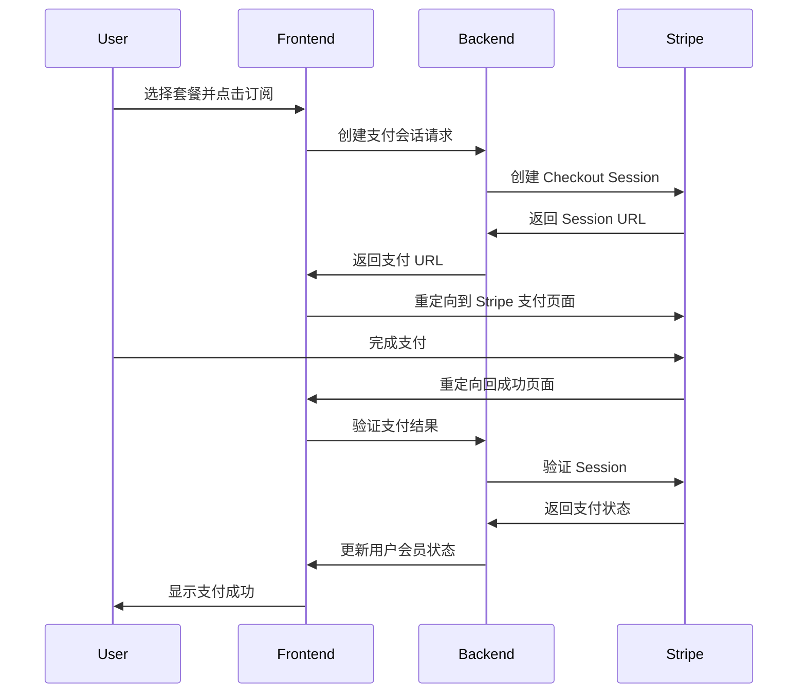

# Nikosolo Web2 支付与会员系统文档

## 概述

Nikosolo Web2 实现了完整的支付与会员订阅系统，支持多种支付方式和灵活的会员等级。系统集成了 Stripe 和 Hel 两种支付渠道，为用户提供安全、便捷的支付体验。

## 系统架构

### 核心组件

1. **支付服务** (`src/services/paymentService.ts`)
   - 统一的支付服务接口
   - 支持多种支付渠道
   - 处理支付会话和验证

2. **API 服务** (`src/services/api/payments.ts`)
   - 与后端支付 API 交互
   - 处理支付会话创建和验证
   - 管理订阅信息

3. **定价页面** (`src/pages/Pricing.tsx`)
   - 展示会员计划
   - 处理支付流程
   - 管理支付回调

4. **状态管理** (`src/store/pricingStore.ts`)
   - 管理定价和会员状态
   - 缓存支付信息

## 会员等级

### 套餐类型

```typescript
export type PlanType = 'free' | 'premium' | 'premium_plus'
```

| 套餐 | 月费 | 年费 | 特权 |
|------|------|------|------|
| **Free** | $0 | $0 | - 基础功能<br>- 有限的生成次数<br>- 社区支持 |
| **Premium** | $29 | $290 | - 无限生成<br>- 高级模型访问<br>- 优先支持<br>- 批量处理 |
| **Premium Plus** | $99 | $990 | - Premium 所有特权<br>- 独占模型<br>- API 访问<br>- 定制功能<br>- 专属客服 |

### 用户权限管理

```typescript
export interface UserPermission {
  generate_image?: boolean      // 图像生成权限
  create_model?: boolean        // 创建模型权限
  train_model?: boolean         // 训练模型权限
  model_tokenization?: boolean  // 模型代币化权限
  create_workflow?: boolean     // 创建工作流权限
  use_workflow?: boolean        // 使用工作流权限
}
```

## 支付流程

### Stripe 支付流程



### Hel 支付流程

Hel 是一个 Web3 支付解决方案，目前仅支持 Premium 套餐：

```typescript
async redirectToPayment(planId: string, provider: 'stripe' | 'hel' = 'stripe') {
  if (provider === 'hel') {
    // Helio 仅支持 premium 套餐
    if (planId === 'premium') {
      window.location.href = 'https://app.hel.io/pay/6868f3ae1ad680ade010fda7'
    } else {
      throw new Error('Helio payment currently only supports Premium plan')
    }
  }
}
```

## 核心实现

### 1. 创建支付会话

```typescript
async createStripePaymentSession(planId: string, mode: PaymentMode = 'subscription'): Promise<string> {
  try {
    const request: CreateCheckoutSessionRequest = {
      plan: planId,
      mode: mode,
      success_url: `${window.location.origin}/pricing?success=true&provider=stripe&session_id={CHECKOUT_SESSION_ID}`,
      cancel_url: `${window.location.origin}/pricing?canceled=true&provider=stripe`
    }

    const response = await api.payments.createStripeCheckoutSession(request)
    return response.url
  } catch (error) {
    console.error('Failed to create Stripe payment session:', error)
    throw new Error('Failed to create Stripe payment session')
  }
}
```

### 2. 处理支付回调

```typescript
// 在 Pricing 页面处理 URL 参数
useEffect(() => {
  const success = searchParams.get('success')
  const canceled = searchParams.get('canceled')
  const sessionId = searchParams.get('session_id')
  const provider = searchParams.get('provider') as 'stripe' | 'hel'

  if (success === 'true' && sessionId) {
    handlePaymentSuccess(sessionId, provider)
  } else if (canceled === 'true') {
    showToast({
      severity: 'info',
      message: 'Payment canceled'
    })
  }
}, [searchParams])
```

### 3. 验证支付结果

```typescript
async handlePaymentSuccess(sessionId: string, provider: 'stripe' | 'hel' = 'stripe') {
  try {
    setIsProcessing(true)
    
    if (provider === 'stripe') {
      const verification = await paymentService.verifyStripePaymentSession(sessionId)
      if (verification.success) {
        console.log('Stripe payment successful:', verification)
        // 刷新用户信息
        fetchUserDetails()
        return verification
      }
    } else if (provider === 'hel') {
      // Hel 支付通过 webhook 处理
      const transaction = await paymentService.getHelTransaction(sessionId)
      console.log('Hel payment successful:', transaction)
      return transaction
    }
  } catch (error) {
    showToast({
      severity: 'error',
      message: 'Payment verification failed, please contact customer service'
    })
  } finally {
    setIsProcessing(false)
  }
}
```

## API 接口

### 支付相关端点

```typescript
export const API_ENDPOINTS = {
  PAYMENTS: {
    // Stripe 支付
    STRIPE: {
      CREATE_SESSION: '/payments/stripe/checkout-sessions',
      VERIFY_SESSION: (sessionId: string) => `/payments/stripe/checkout-sessions/${sessionId}/verify`,
      GET_INFO: (userId: string) => `/payments/stripe/subscriptions/${userId}`,
      CANCEL: (userId: string) => `/payments/stripe/subscriptions/${userId}`,
      WEBHOOK: '/payments/stripe/webhooks',
    },
    // Hel 支付
    HEL: {
      WEBHOOK: '/payments/hel/webhooks',
      GET_TRANSACTION: (signature: string) => `/payments/hel/transactions/signature/${signature}`,
    }
  }
}
```

### 请求/响应类型

```typescript
// 创建支付会话请求
export interface CreateCheckoutSessionRequest {
  plan: string                // 套餐 ID
  mode: PaymentMode          // 'subscription' | 'payment'
  success_url?: string       // 支付成功回调 URL
  cancel_url?: string        // 支付取消回调 URL
  metadata?: Record<string, string>
}

// 支付会话响应
export interface CreateCheckoutSessionResponseDto {
  session_id: string         // 会话 ID
  url: string               // 支付页面 URL
}

// 验证结果
export interface VerifyCheckoutSessionResponseDto {
  success: boolean          // 支付是否成功
  payment_status: string    // 支付状态
  customer_email?: string   // 客户邮箱
  amount_total?: number     // 支付金额
  currency?: string         // 货币类型
  subscription_id?: string  // 订阅 ID
}
```

## 订阅管理

### 查询用户订阅状态

```typescript
// 获取用户计划信息
export interface PlanState {
  sub_balance: number       // 订阅余额
  paid_balance: number      // 付费余额  
  plan_type: PlanType      // 当前套餐类型
  plan_expired_at?: Date   // 套餐过期时间
  subscription_id?: string // Stripe 订阅 ID
  next_refresh_at: Date    // 下次刷新时间
}
```

### 取消订阅

```typescript
async cancelSubscription(userId: string): Promise<CancelSubscriptionResponseDto> {
  return apiService.delete<CancelSubscriptionResponseDto>(
    API_ENDPOINTS.PAYMENTS.STRIPE.CANCEL(userId),
    { requiresAuth: true }
  )
}
```

## UI 实现

### 定价卡片组件

```typescript
const PlanCard: React.FC<PlanCardProps> = ({ 
  plan, 
  currentPlan, 
  onSubscribe 
}) => {
  const isCurrentPlan = currentPlan === plan.id
  const isFreePlan = plan.id === 'free'
  
  return (
    <div className={getPlanStyle(plan.id)}>
      <h3>{plan.name}</h3>
      <div className="price">
        <span className="currency">$</span>
        <span className="amount">{plan.monthlyPrice}</span>
        <span className="period">/month</span>
      </div>
      
      <ul className="features">
        {plan.features.map(feature => (
          <li key={feature}>{feature}</li>
        ))}
      </ul>
      
      <button
        onClick={() => onSubscribe(plan.id)}
        disabled={isCurrentPlan || isProcessing}
        className={getButtonStyle(plan.id, isCurrentPlan)}
      >
        {getButtonText(plan.id, isCurrentPlan)}
      </button>
    </div>
  )
}
```

### 支付方式选择

```typescript
const PaymentMethodSelector: React.FC = ({ 
  selected, 
  onSelect 
}) => {
  return (
    <div className="payment-methods">
      <button
        onClick={() => onSelect('stripe')}
        className={selected === 'stripe' ? 'active' : ''}
      >
        
        Credit Card
      </button>
      
      <button
        onClick={() => onSelect('hel')}
        className={selected === 'hel' ? 'active' : ''}
      >
        
        Crypto Payment
      </button>
    </div>
  )
}
```

## Webhook 处理

系统通过 Webhook 接收支付平台的异步通知：

### Stripe Webhook

```typescript
// 后端处理 Stripe webhook
app.post('/payments/stripe/webhooks', async (req, res) => {
  const sig = req.headers['stripe-signature']
  
  try {
    const event = stripe.webhooks.constructEvent(
      req.body,
      sig,
      webhookSecret
    )
    
    switch (event.type) {
      case 'checkout.session.completed':
        // 处理支付成功
        await handlePaymentSuccess(event.data.object)
        break
      case 'customer.subscription.deleted':
        // 处理订阅取消
        await handleSubscriptionCanceled(event.data.object)
        break
    }
    
    res.json({ received: true })
  } catch (err) {
    res.status(400).send(`Webhook Error: ${err.message}`)
  }
})
```

## 安全措施

1. **支付会话验证**
   - 所有支付结果必须在后端验证
   - 使用会话 ID 防止伪造支付
   - 验证支付金额和套餐匹配

2. **HTTPS 强制**
   - 所有支付相关页面必须使用 HTTPS
   - 支付回调 URL 必须是 HTTPS

3. **防止重复支付**
   - 使用幂等键防止重复创建订阅
   - 检查用户当前订阅状态

4. **敏感信息保护**
   - 不在前端存储支付信息
   - 使用 Stripe 的安全支付页面
   - 遵循 PCI DSS 标准

## 错误处理

```typescript
// 统一的错误处理
try {
  await paymentService.createPaymentSession(planId)
} catch (error) {
  if (error.code === 'INSUFFICIENT_PERMISSIONS') {
    showToast({
      severity: 'error',
      message: 'You need to verify your email before subscribing'
    })
  } else if (error.code === 'ALREADY_SUBSCRIBED') {
    showToast({
      severity: 'info',
      message: 'You already have an active subscription'
    })
  } else {
    showToast({
      severity: 'error',
      message: 'Payment failed, please try again later'
    })
  }
}
```

## 配置说明

### 环境变量

```bash
# Stripe 配置
VITE_STRIPE_PUBLISHABLE_KEY=pk_test_xxx
STRIPE_SECRET_KEY=sk_test_xxx  # 仅后端使用
STRIPE_WEBHOOK_SECRET=whsec_xxx # 仅后端使用

# Hel 配置
HEL_API_KEY=xxx                 # 仅后端使用
```

### Stripe 设置

1. 在 [Stripe Dashboard](https://dashboard.stripe.com/) 创建账号
2. 获取 API 密钥
3. 配置产品和价格
4. 设置 Webhook 端点
5. 配置支付成功/取消 URL

## 最佳实践

1. **优雅的加载状态**
   ```typescript
   const [isProcessing, setIsProcessing] = useState(false)
   
   // 显示加载状态
   if (isProcessing) {
     return <LoadingSpinner message="Processing payment..." />
   }
   ```

2. **清晰的用户反馈**
   - 支付过程中禁用按钮
   - 显示处理进度
   - 成功/失败的明确提示

3. **订阅状态同步**
   - 支付成功后立即刷新用户信息
   - 定期检查订阅状态
   - 处理订阅过期情况

4. **支付重试机制**
   - 保存未完成的支付意图
   - 提供重新支付选项
   - 记录支付失败原因

5. **合规性要求**
   - 显示服务条款和隐私政策
   - 提供发票和收据
   - 支持退款流程

---

**文档版本**: v1.0  
**最后更新**: 2025年8月4日  
**维护者**: Nikosolo 开发团队