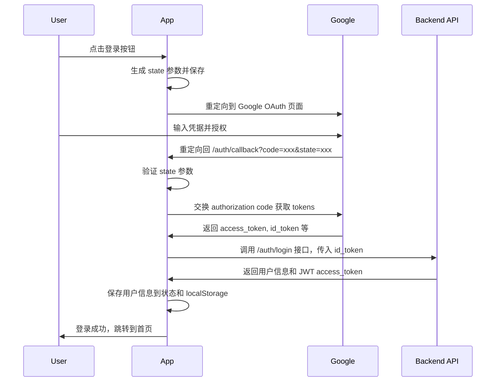

# Nikosolo Web2 用户认证系统文档

## 概述

Nikosolo Web2 采用基于 Google OAuth 2.0 的用户认证系统，实现了安全、便捷的用户登录和身份管理功能。系统完全摒弃了原有的 Web3 钱包认证方式，采用更加主流的 Web2 认证模式。

## 认证架构

### 核心组件

1. **认证服务** (`src/services/authService.ts`)
   - 单例模式的认证服务
   - 处理 Google OAuth 流程
   - 管理用户会话和令牌

2. **状态管理** (`src/store/loginStore.ts`)
   - 基于 Jotai 的原子化状态管理
   - 管理用户认证状态
   - 处理登录/登出逻辑

3. **UI 组件**
   - `LoginModal.tsx` - 登录模态框
   - `AuthCallback.tsx` - OAuth 回调处理页面
   - `ProtectedRoute.tsx` - 路由保护组件

4. **API 服务** (`src/services/api/auth.ts`)
   - 与后端认证 API 交互
   - 处理令牌交换和验证

## 认证流程

### 登录流程



### 核心代码实现

#### 1. OAuth URL 构建

```typescript
public getGoogleAuthUrl(): string {
  const redirectUri = `${window.location.origin}${API_CONFIG.GOOGLE_OAUTH.REDIRECT_URI}`
  const scope = API_CONFIG.GOOGLE_OAUTH.SCOPE
  const responseType = 'code'
  const state = Math.random().toString(36).substring(2, 15)
  
  // 保存 state 到 localStorage 用于验证
  const stateData = {
    state,
    timestamp: Date.now()
  }
  localStorage.setItem('oauth_state', JSON.stringify(stateData))
  
  return `${API_CONFIG.GOOGLE_OAUTH.OAUTH_URL}?` +
    `client_id=${API_CONFIG.GOOGLE_OAUTH.CLIENT_ID}&` +
    `redirect_uri=${encodeURIComponent(redirectUri)}&` +
    `scope=${encodeURIComponent(scope)}&` +
    `response_type=${responseType}&` +
    `state=${state}&` +
    `access_type=offline&` +
    `prompt=consent&` +
    `include_granted_scopes=true`
}
```

#### 2. Token 交换

```typescript
private async exchangeCodeForTokens(code: string): Promise<AuthTokens> {
  const response = await fetch(API_CONFIG.GOOGLE_OAUTH.TOKEN_URL, {
    method: 'POST',
    headers: {
      'Content-Type': 'application/x-www-form-urlencoded',
    },
    body: new URLSearchParams({
      client_id: API_CONFIG.GOOGLE_OAUTH.CLIENT_ID,
      client_secret: API_CONFIG.GOOGLE_OAUTH.CLIENT_SECRET,
      code,
      grant_type: 'authorization_code',
      redirect_uri: redirectUri,
    }),
  })
  
  return response.json()
}
```

#### 3. 后端登录调用

```typescript
// 使用 id_token 调用后端登录 API
const loginResponse = await authApi.login({
  provider: "google",
  google_token: tokens.id_token
})

// 设置 Bearer token 用于后续 API 调用
authApi.setBearerToken(loginResponse.access_token)
```

## 状态管理

### 用户状态结构

```typescript
export interface UserState {
  isAuthenticated: boolean          // 是否已认证
  user: GoogleUserInfo | null      // Google 用户信息
  userDetails: UserBaseInfo | null // 详细用户信息（来自后端）
  isLoading: boolean               // 加载状态
  error: string | null             // 错误信息
}

export interface GoogleUserInfo {
  id: string         // Google 用户 ID
  email: string      // 邮箱
  name: string       // 显示名称
  picture: string    // 头像 URL
  tokens: {
    did: string              // 用户唯一标识
    access_token: string     // 访问令牌
    id_token: string         // ID 令牌
    expires_in: number       // 过期时间
    token_type: string       // 令牌类型
  }
}
```

### 主要 Atoms

1. **userStateAtom** - 用户认证状态
2. **loginModalAtom** - 登录弹窗状态
3. **loginAtom** - 处理登录逻辑
4. **logoutAtom** - 处理登出逻辑
5. **fetchUserDetailsAtom** - 获取用户详细信息

## 会话持久化

系统通过 localStorage 实现会话持久化：

```typescript
// 保存用户信息
private saveToStorage(): void {
  if (this.currentUser) {
    localStorage.setItem('auth_user', JSON.stringify(this.currentUser))
  }
  if (this.tokens) {
    localStorage.setItem('auth_tokens', JSON.stringify(this.tokens))
  }
}

// 应用启动时恢复会话
export const initUserStateAtom = atom(
  null,
  (_, set) => {
    const user = authService.getCurrentUser()
    if (user && authService.isAuthenticated()) {
      // 重新设置 Bearer Token
      if (user.tokens && user.tokens.access_token) {
        authApi.setBearerToken(user.tokens.access_token)
      }
      // 更新用户状态
      set(userStateAtom, {
        isAuthenticated: true,
        user,
        userDetails: null,
        isLoading: false,
        error: null
      })
      // 获取详细用户信息
      set(fetchUserDetailsAtom)
    }
  }
)
```

## 路由保护

使用 `ProtectedRoute` 组件保护需要认证的路由：

```typescript
const ProtectedRoute: React.FC<{ children: React.ReactNode }> = ({ children }) => {
  const [userState] = useAtom(userStateAtom)
  const showLoginModal = useSetAtom(showLoginModalAtom)
  
  if (!userState.isAuthenticated) {
    showLoginModal()
    return null
  }
  
  return <>{children}</>
}
```

## API 集成

所有需要认证的 API 调用都会自动携带 Bearer Token：

```typescript
// 在 BaseApiService 中自动添加认证头
protected async request<T>(
  url: string,
  options: RequestOptions = {}
): Promise<T> {
  const headers = {
    ...API_CONFIG.DEFAULT_HEADERS,
    ...options.headers,
  }
  
  if (options.requiresAuth && this.bearerToken) {
    headers['Authorization'] = `Bearer ${this.bearerToken}`
  }
  
  // 发送请求...
}
```

## 安全措施

1. **State 参数验证**
   - 防止 CSRF 攻击
   - 使用随机生成的 state 参数
   - 验证回调中的 state 与保存的一致

2. **Token 安全**
   - Access Token 仅保存在内存和 localStorage
   - 不在 URL 中传递敏感信息
   - Token 过期自动处理

3. **HTTPS 强制**
   - 所有认证相关请求必须使用 HTTPS
   - OAuth 回调 URL 必须是 HTTPS

## 错误处理

系统实现了完善的错误处理机制：

1. **OAuth 错误**
   - 用户拒绝授权
   - 无效的 authorization code
   - State 参数不匹配

2. **API 错误**
   - 401 未授权 - 自动清除登录状态
   - 网络错误 - 显示友好提示
   - 服务器错误 - 记录错误日志

3. **用户友好提示**
   - 使用 Toast 组件显示错误信息
   - 提供重试机制
   - 自动跳转到合适页面

## 配置说明

### 环境变量

```bash
# Google OAuth 配置
VITE_GOOGLE_CLIENT_ID=your-google-client-id
VITE_GOOGLE_CLIENT_SECRET=your-google-client-secret

# API 配置
VITE_API_BASE_URL=/mavae_api
VITE_BEARER_TOKEN=your-bearer-token  # 用于开发环境
```

### Google OAuth 设置

1. 在 [Google Cloud Console](https://console.cloud.google.com/) 创建项目
2. 启用 Google+ API
3. 创建 OAuth 2.0 客户端 ID
4. 设置授权重定向 URI：`https://your-domain.com/auth/callback`
5. 获取客户端 ID 和密钥

## 最佳实践

1. **始终验证用户状态**
   ```typescript
   const [userState] = useAtom(userStateAtom)
   if (!userState.isAuthenticated) {
     // 处理未登录情况
   }
   ```

2. **使用路由保护**
   ```typescript
   <Route path="/profile" element={
     <ProtectedRoute>
       <Profile />
     </ProtectedRoute>
   } />
   ```

3. **处理 Token 过期**
   - 监听 401 错误
   - 自动刷新或重新登录
   - 保存用户操作状态

4. **优雅的加载状态**
   - 显示加载指示器
   - 防止重复请求
   - 处理竞态条件

---

**文档版本**: v1.0  
**最后更新**: 2024年1月  
**维护者**: Nikosolo 开发团队